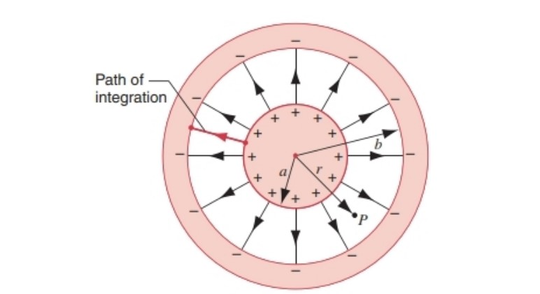
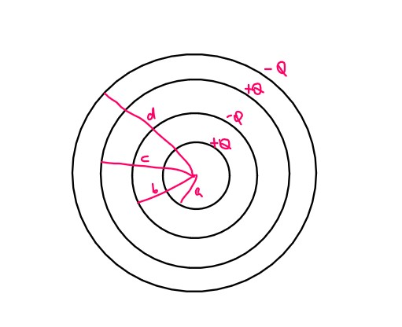
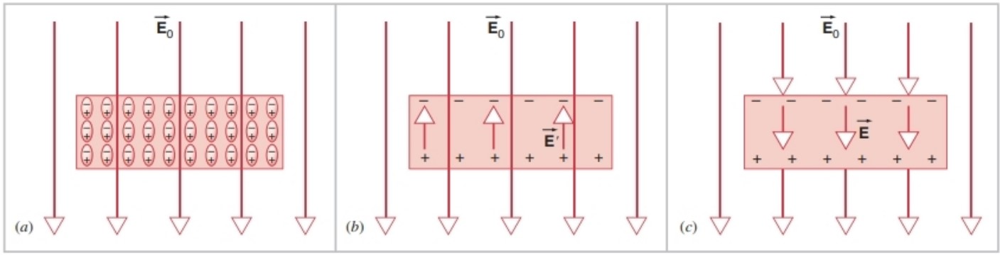
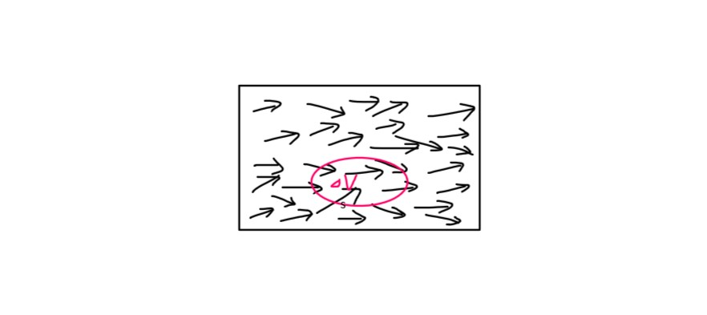
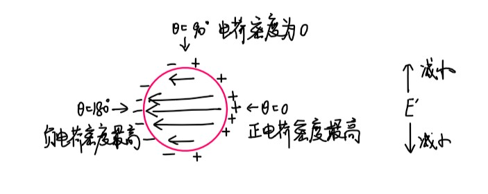
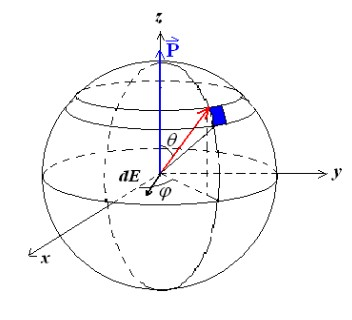
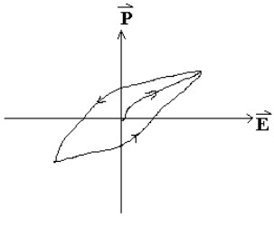
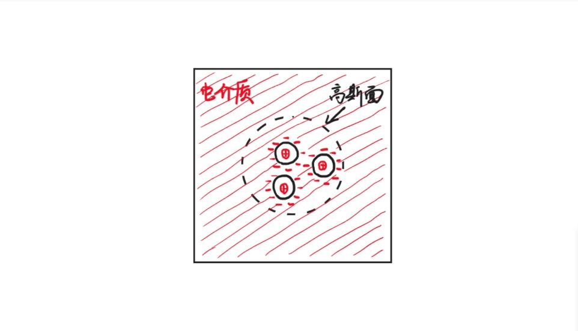

# Chapter5 电容与电介质

***

## 5.1 电容器

组成：两个空间上分离的导体，各自带$+q$和$-q$的电荷。

### 电容

定义式：

$$C=\frac{q}{\Delta V}$$

电容是电容器的固有属性，与所带电荷$q$和电压差$\Delta V$无关。

**平行板电容器：**

已知平行板电容器的电荷面密度为$\sigma$，板面积为$A$，则

$$q=\sigma A$$

$$\Delta 
V=V_B-V_A=-\int_A^BE\cdot dl$$

由高斯定理：

$$E=\frac{\sigma}{\varepsilon_0}$$

又已知两板间距为$d$，因此：

$$C=\frac{q}{\Delta V}=\frac{\sigma A}{\frac{\sigma}{\varepsilon_0}\cdot d}=\frac{\varepsilon_0 A}{d}$$

**圆柱形电容器：**

已知圆柱形电容器长度为$L$，内外表面带电量分别为$+Q$，$-Q$。

对于距离圆柱轴为$r$的位置，由高斯定理：

$$EA=E\cdot2\pi rL=\frac{Q}{\varepsilon_0}$$

$$E=\frac{Q}{2\pi\varepsilon_0Lr}$$

距离为$a$（内筒）和$b$（外筒）的电势差：

$$\Delta V=V_a-V_b=-\int_b^aE\cdot dr=\int_a^b\frac{Q}{2\pi\varepsilon_0rL}dr=\frac{Q}{2\pi\varepsilon_0 L}\ln(\frac{b}{a})$$

综上：圆柱形电容器的电容为

$$C=\frac{Q}{\Delta V}=\frac{2\pi\varepsilon_0 L}{\ln(\frac{b}{a})}$$

**例3：球形电容器**

已知球形电容器内部球的半径为$a$，外壳到球心的距离为$b$，分别带电$+q$，$-q$，考虑距离球心为$r$的电场强度，由高斯定理：

$$E=\frac{q}{4\pi\varepsilon_0r^2},~a<r<b$$

$$\Delta V=-\int_b^aE\cdot dr=\frac{q}{4\pi\varepsilon_0}(\frac{1}{a}-\frac{1}{b})$$

综上：球形电容器的电容为

$$C=\frac{q}{\Delta V}=4\pi\varepsilon_0\frac{ab}{b-a}$$

!!! Note
    当$b\rightarrow\infty$时，$C\rightarrow 4\pi\varepsilon_0 a$，因此一个孤立的导体球其实也是一个电容。

### 电容器串并联

并联时，两个电容器的$V$相等：

$$V=\frac{Q_1}{C_1}=\frac{Q_2}{C_2}~\Rightarrow ~Q_2=Q_1\frac{C_2}{C_1}$$

等效电容：

$$C=\frac{Q}{V}=\frac{Q_1+Q_2}{V}=\frac{Q_1(C_1+C_2)}{C_1V}=C_1+C_2$$

串联时，两个电容器的$Q$相等：

$$V=V_1+V_2=\frac{Q}{C_1}+\frac{Q}{C_2}$$

等效电容：

$$\frac{1}{C}=\frac{V}{Q}=\frac{1}{C_1}+\frac{1}{C_2}$$

!!! Example
    **求$a$和$d$之间的电容。**

      
    由高斯定理：$E_{bc}=0$  
    $\Delta V_{ad}=\int_a^b\frac{Q}{2\pi\varepsilon_0rL}dr+0+\int_c^d\frac{Q}{2\pi\varepsilon_0rL}dr$  
    $C=\frac{Q}{\Delta V_{ad}}=\frac{2\pi\varepsilon_0L}{\ln(\frac{b}{a})+\ln(\frac{d}{c})}$  
    可以看作两个电容器的串联。  

***

## 5.2 电场中的能量

要计算电容器中储存的能量，即计算给电容器充电做的功。

$$dW=Vdq=(\frac{q}{C})dq$$

$$W=\frac{1}{C}\int_0^Qqdq=\frac{1}{2}\frac{Q^2}{C}=\frac{1}{2}CV^2$$

对于平行板电容器：

$$U=\frac{1}{2}\frac{Q^2}{(A\varepsilon_0/d)}$$

!!! Note
    实际上不均匀电场也适用，如圆柱形电容器。

由于

$$E=\frac{\sigma}{\varepsilon_0}=\frac{Q}{\varepsilon_0 A}$$

因此代入得：

$$U=\frac{1}{2}E^2\varepsilon_0Ad$$

其中$Ad$为电场的体积。

能量密度：

$$u=\frac{U}{Ad}=\frac{1}{2}\varepsilon_0E^2$$

其适用于所有有电场的地方。

***

## 5.3 电介质（电场中的绝缘体）

**介电常数：**

一种材料的介电常数等于将其填满电容器之间的区域后的电容与原来的电容之比：

$$\kappa_e=\frac{C}{C_0}$$

其中$C_0$为原来的电容，$C$为将电容器之间的区域用这种材料填满后的电容，$\kappa_e\geqslant 1$（只有在真空中才恰好为1）。

当$Q$不变时，插入电介质：

$$V=\frac{Q}{C}=\frac{Q}{\kappa_eC_0}=\frac{V_0}{\kappa_e}$$

$$E=\frac{V}{d}=\frac{E_0}{\kappa_e}$$

当$V$不变时，插入电介质：

$$Q'=\kappa_eC_0V$$

!!! Example
    考虑单一点电荷作为电容器的情形，若点电荷带电量为$Q$，则其在真空中距离为$r$处的电场强度  
    $E=\frac{Q}{4\pi\varepsilon_0r^2}$  
    但若其放在某一电介质中（相当于将电容器之间的区域用这种电介质填满），则  
    $E'=\frac{E_0}{\kappa_e}=\frac{Q}{4\pi\varepsilon_0\kappa_er^2}$  

**宏观理解$C$的增加：**

* **插入导体**：相当于形成了电容器的串联

* **插入电介质**：极化

### 极化的微观原理

电介质分为两种：

* **无极分子电介质：** 正电荷中心与负电荷中心重合（如二氧化碳分子）
* 
* **有极分子电介质：** 正电荷中心与负电荷中心不重合（如水分子）

**无极分子电介质的微观原理（电子位移极化）：**

未加电场时，每个分子极矩$p=0$。

外加电场$E_0$后，分子内的正负电荷被拉开，电子云发生位移，出现感生电偶极矩（如图(a)）。

$E_0$方向上前后两个分子的正电荷和负电荷首尾相接，刚好抵消，最后只留下最前面一层正电荷和最后面一层负电荷，这两层电荷之间产生的电场为$E'$（如图(b)）。

叠加后，电介质内部的电场$\vec{E}=\vec{E_0}+\vec{E'}$（如图(c)）。

**有极分子电介质的微观原理（取向极化）：**

未加电场时，每个分子有极矩$p$，但由于分子的热运动，不同分子的极矩方向不同，但$\sum\vec{p}=0$。

外加电场$E_0$后，极矩逐渐转到电场方向，同样也会两两抵消，只留下最前面一层正电荷和最后面一层负电荷，最后电介质内部的电场同样为$\vec{E}=\vec{E_0}+\vec{E'}$。

!!! Note
    对于有极分子电介质来说，发生取向极化的同时也有发生电子位移极化，但前者的效应大得多。  
    但是，若$E_0$不断变化方向，且频率很大，则取向极化会跟不上，而电子位移极化能跟上，此时电子位移极化的效应更大。

### 极化强度矢量

对于有极分子电介质来说，每个分子最后的极矩$\vec{p}$并不一定完全按照$\vec{E_0}$的走向，因为还有热运动的影响，因此需要引入**极化强度矢量$\vec{P}$**：

$$\vec{P}=\frac{\sum\vec{p_m}}{\Delta V}$$

!!! Note
    $\vec{P}$是一个空间上的函数，记作$P(x,y,z)$或许更加合理。
    若电介质由不同种类的分子构成，则首尾不一定能相消，此时$\vec{P}$是空间上的函数，记为$\vec{P}(x,y,z)$。

**探究电介质表面电荷面密度与$\vec{P}$的关系：**

在电介质的表面某处，取一个极小的斜圆柱，使得这个圆柱的底面与切面平行，倾斜方向与外加电场$\vec{E_0}$一致。

对于圆柱的高度，我们让其倾斜长度等于电介质分子正负极的距离$l$，并且我们保证圆柱的内部只能刚好容纳电介质最外层分子的正极部分，而负极部分刚好在外。

由于圆柱的体积很小，因此我们假设其内部的极矩都沿同一方向，即外加电场$\vec{E_0}$的方向，也即所有分子的正负极距离矢量$\vec{l}$都与$\vec{E_0}$方向相同。

因此圆柱内的极化强度矢量

$$\vec{P}=\frac{\sum\vec{p_m}}{\Delta V}=nq\vec{l}$$

其中$n$为分子数密度，$q$为每个分子所带正电荷（正负电荷相等）。

圆柱内分子总数

$$dN=ndV=nldA\cos\theta$$

圆柱内所带电荷总量

$$dq'=qdN=nqldA\cos\theta=PdA\cos\theta$$

因此，电介质表面的电荷面密度

$$\sigma'=\frac{dq'}{dA}=P\cos\theta=\vec{P}\cdot\vec{n}=P_n$$

即：电介质表面某一点处的电荷面密度等于该点处极化强度矢量的垂直分量。

### 退极化场

**退极化场**指的是束缚电荷产生的电场$\vec{E'}$。

以上图为例：

$$\vec{E}=\vec{E_0}+\vec{E'}$$

在电介质内：$\vec{E_0}$，$\vec{E'}$反向，减小$\vec{E}$

在电介质外：$\vec{E_0}$，$\vec{E'}$同向，增大$\vec{E}$

!!! Example
    **计算球心的退极化场$E'$。**

      
    单独看蓝色区域：  
    $\sigma_e'=P\cos\theta$  
    $dE'=\frac{dq'}{4\pi\varepsilon_0R^2}=\frac{\sigma_e'dA}{4\pi\varepsilon_0R^2}=\frac{P\cos\theta dA}{4\pi\varepsilon_0R^2}$  
    $dA=Rd\theta\cdot R\sin\theta d\varphi$  
    $dE'=\frac{P}{4\pi\varepsilon_0}\cos\theta\sin\theta d\theta d\varphi$  
    $dE'_z=dE'\cos\theta=\frac{P}{4\pi\varepsilon_0}\cos^2\theta\sin\theta d\theta d\varphi$  
    总体面积分：  
    $E'_z=\frac{P}{4\pi\varepsilon_0}\int_0^\pi\cos^2\theta\sin\theta d\theta\int_0^{2\pi}d\varphi=\frac{P}{3\varepsilon_0}$  

### 电介质的极化规律

对于不同的电介质材料，加入外加电场后电介质内部的总电场$\vec{E}$和$\vec{P}$的对应关系不同。

**各向同性：**

$$\vec{P}=\chi_e\varepsilon_0\vec{E}$$

其中，$\chi_e=\kappa_e-1$称为**极化率**。

**张量：**

例如二氧化硅晶体、水晶等

$$\begin{pmatrix}
    P_x\\\
    P_y\\\
    P_z
\end{pmatrix}=\begin{pmatrix}
\chi_{xx}\chi_{xy}\chi_{xz}\\\
\chi_{yx}\chi_{yy}\chi_{yz}\\\
\chi_{zx}\chi_{zy}\chi_{zz}
\end{pmatrix}\begin{pmatrix}
\varepsilon_0E_x\\\
\varepsilon_0E_y\\\
\varepsilon_0E_z
\end{pmatrix}$$

**铁电材料：**

例如钛酸钡、酒石酸钾等。

发生电滞效应，可用作信息存储器。

### 电位移矢量

由高斯定理：

$$\varepsilon_0\iint\limits_{\substack{\circ}}\vec{E}\cdot d\vec{A}=\sum\limits_{In}(q_1+q_2)$$

其中，$q_1$表示放置在空洞中心的点电荷（作为电容器），$q_2$表示$q_1$对应的束缚电荷。

由极化强度矢量的推导步骤：

$$\iint\limits_{\substack{\circ}}\vec{P}\cdot d\vec{A}=-\sum\limits_{In}q_2$$

$$\iint\limits_{\substack{\circ}}\varepsilon_0\vec{E}\cdot d\vec{A}=\sum\limits_{In}q_1-\iint\limits_{\substack{\circ}}\vec{P}\cdot d\vec{A}$$

$$\iint\limits_{\substack{\circ}}(\varepsilon_0\vec{E}+\vec{P})\cdot d\vec{A}=\sum\limits_{In}q_1$$

记**电位移矢量**：

$$\vec{D}=\varepsilon_0\vec{E}+\vec{P}$$

则可得到**电介质中的高斯定理**：

$$\iint\limits_{\substack{\circ}}\vec{D}\cdot d\vec{A}=\sum\limits_{In}q_1$$

我们之前所了解的高斯定理只针对于周围都是真空的情况，现在确定了电介质，于是扩展到了更一般的高斯定理。

对于各向同性的材料：

$$\vec{D}=\varepsilon_0\vec{E}+\vec{P}=\varepsilon_0\vec{E}+\chi_e\varepsilon_0\vec{E}=\kappa_e\varepsilon_0\vec{E}$$

!!! Note
    若有$\oint\vec{E}\cdot d\vec{l}=0$，并不能推出$\oint\vec{D}\cdot d\vec{l}=0$。