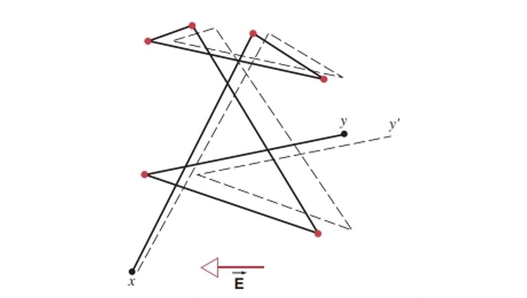

# Chapter6 恒定电流

***

## 6.1 电流

**电流强度：**

$$i=\lim\limits_{\Delta t\rightarrow0}\frac{\Delta q}{\Delta t}=\frac{dq}{dt}$$

直观理解：单位时间内通过某横截面的电荷量。

**电流密度矢量：**

$$di=\vec{j}\cdot d\vec{A}$$

$$i=\iint_A\vec{j}\cdot d\vec{A}=\iint_Aj\cos\theta dA$$

直观理解：$\vec{j}$也是一种场。

**电流连续方程：**

若曲面$A$封闭，则

$$\iint\limits_{\substack{\circ}}\vec{j}\cdot d\vec{A}=0$$

***

## 6.2 电阻

**欧姆定律：**

对于线性元件：

$$R=\frac{\Delta V}{i}$$

对于非线性元件：

$$R=\frac{dV}{di}$$

**电导（conductance）：**

$$G=\frac{1}{R}$$

电导即为电阻的倒数，单位为西门子（S）。

**电阻率（resistivity）：**

$$R=\rho\frac{L}{A}~\Rightarrow ~\rho=\frac{RA}{L}$$

该公式只针对于立柱体，更一般地：

$$R=\int\rho\frac{dl}{A}$$

**电导率（conductivity）：**

$$\sigma=\frac{1}{\rho}$$

电导率为电阻率的倒数，电导率才是材料特定的性质。

!!! Example
    **大地可看作均匀的导电介质，电阻率为$\rho$，用一半径为$a$的球形电极与大地表面相接，半个球体埋在地面下，求接地电阻。**  

    $R=\int\rho\frac{dl}{A}=\int_a^{\infty}\rho\frac{dr}{2\pi r^2}=\frac{\rho}{2\pi a}$  

**电阻率与温度关系（金属）：**

$$\rho(T)=\rho_0+aT$$

**欧姆定律的微分形式：**

$$j\Delta A=\Delta i=\frac{\Delta V}{R}=\frac{E\Delta l}{\rho\frac{\Delta l}{\Delta A}}$$

$$\vec{j}=\frac{\vec{E}}{\rho}=\sigma\vec{E}$$

**电功率：**

$$P=\frac{W}{\Delta t}=\frac{qV_{AB}}{\Delta t}=i\Delta V_{AB}$$

若负载为电阻（而不是电机）时：

$$P=i^2R=\frac{V^2}{R}$$

**欧姆定律的微观解释：**

下图为在导体中，电子的自由运动与碰撞轨迹：

* **平均自由程$\lambda$**：两次碰撞之间的平均距离。

* **平均自由时间$\tau$**：两次碰撞之间的平均时间。

* **平均热运动速度$v_t$**

加上电场后，电子的运动轨迹偏移，从y到y'。

$$\vec{a}=-\frac{e}{m}\vec{E}$$

在两次碰撞之间，假设刚碰撞后电子的漂移速度为0，在下一次碰撞前漂移速度为$u_1$，则

$$\vec{u_1}=\vec{a}\tau=-\frac{e}{m}\vec{E}\tau$$

平均漂移速度：

$$\vec{u}=-\frac{e}{2m}\vec{E}\tau=-\frac{e}{2m}\frac{\lambda}{v_t}\vec{E}$$

对于一定体积内通过的电荷量：

$$\Delta q=neu\Delta t\cdot\Delta A$$

其中$n$为载流子密度，即单位体积内电子数量。

$$\Delta i=\frac{\Delta q}{\Delta t}=neu\cdot \Delta A$$

$$j=\frac{\Delta i}{\Delta A}=neu$$

$$\vec{j}=-ne\vec{u}=\frac{ne^2}{2m}\frac{\lambda}{v_t}\vec{E}$$

前面已知：

$$\vec{j}=\sigma\vec{E}$$

因此

$$\sigma=\frac{ne^2}{2m}\frac{\lambda}{v_t}$$

$\sigma$为电导率。