

# Chapter7 磁场

***

## 7.1 磁学的基本现象和基本规律

**基本现象：**

* 吸引金属
* 分N极（指向北）和S极（指向南），地球可看作一个巨大的磁铁，地球的北极相当于S极，南极相当于N极
* 同极相斥，异极相吸
* 电生磁，磁生电
* 通电螺线管产生的磁场与条形磁铁产生发磁场类似
* 电流间的相互作用（同向相吸，异向相斥）

**磁单极子：**

不断地切割磁棒，始终无法得到单个的N磁荷或者S磁荷（磁单极子）

因此，如果取一个闭合高斯面，有**磁场的高斯定理**：

$$\iint\limits_{\substack{\circ}}\vec{B}\cdot d\vec{A}=0$$

**分子电流：**

磁棒每一个分子有很多电流环（分子电流），相互抵消后剩下最外围的电流，因此条形磁棒类似于通电螺线管。

因此我们研究磁场，实际上就是在研究电流间的相互作用，而电流本质上是运动的电荷，此即为磁场的来源。

!!! Note
    微观结构：  
    电子绕着原子核公转，同时也在自旋，公转和自旋都会产生电流。不同的原子由于电子的数量和运动状态不同，因此抵消效果不同，这就导致有些原子有磁性，有些则没有。目前常见的磁性材料有氧化铁（第一代磁性材料），钕铁硼（目前最广泛应用，磁性最强），钐钴合金（军用，正在开发）。  

**安培定律：**

定量研究电流元与电流元之间的相互作用。

!!! Success "Definition"
    **电流元：**$i\cdot d\vec{s}$  
    电流大小与长度微元的乘积，矢量。

如图所示：

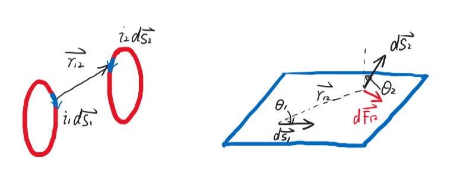

仅考虑大小：

$$dF_{12}=k\frac{i_1i_2ds_1\sin\theta_1ds_2\sin\theta_2}{r_{12}^2}$$

以矢量形式表示：

$$d\vec{F_{12}}=k\frac{i_2d\vec{s_2}\times(i_1d\vec{s_1}\times\hat{r_{12}})}{r_{12}^2}$$

$$k=\frac{\mu_0}{4\pi}=10^{-7}N/A^2$$

$$\mu_0=4\pi\times10^{-7}N/A^2$$

此为真空中的**磁导率（permeability constant）**。

!!! Example
    
    **例1：同向电流**

    $dF_{12}=dF_{21}=k\frac{i_1i_2ds_1ds_2}{r_{12}^2}$  

    **例2：垂直电流**  

    $dF_{21}=k\frac{i_1i_2ds_1ds_2}{r_{12}^2}$  
    $dF_{12}=0$  
    $dF_{12}\neq dF_{21}$  
    看似不符合牛顿第三定律的原因：  
    电流总是完整回路，总体考虑则符合牛顿第三定律，但单独考虑一小段电流元则不然。  

**磁感应强度：**

类似于电场强度的定义，磁感应强度可看作试探电流元受到的力与自身大小的比值，以左边通电线圈在右边某一点处产生的磁感应强度为例：

$$\vec{B_1}=k\oint_{L_1}\frac{i_1d\vec{s_1}\times\hat{r_{12}}}{r_{12}^2}$$

假设电流元$i_2d\vec{s_2}$受到的左边线圈的合力为$d\vec{F_2}$，则：

$$d\vec{F_{12}}=i_2d\vec{s_2}\times\vec{B_1}$$

若采用比值的方式得到磁感应强度，则不同方向的$i_2d\vec{s_2}$受到的力的大小也不同，因此我们定义磁感应强度的大小：

$$B_1=\frac{(dF_2)_{\max}}{i_2ds_2}$$

即改变$i_2d\vec{s_2}$方向得到的最大值。

***

## 7.2 毕奥-萨伐尔定理：

$$\vec{B}=\frac{\mu_0}{4\pi}\int_L\frac{id\vec{s}\times\hat{r}}{r^2}$$

!!! Example
    **例1：直线电流周围的磁感应强度**

    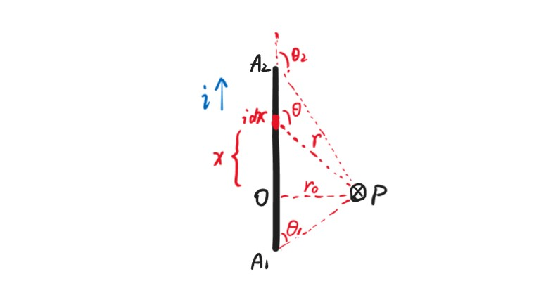  
    方向：垂直平面向内  
    大小：  
    对于如图所示的电流元$id\vec{x}$，其产生的磁感应强度大小  
    $dB=\frac{\mu_0}{4\pi}\frac{idx\sin\theta}{r^2}$  
    由于$r=\frac{r_0}{\sin\theta}$  
    $dx=d(\frac{-r_0}{\tan\theta})=\frac{r_0d\theta}{\sin^2\theta}$  
    因此$dB=\frac{\mu_0}{4\pi}\frac{i\sin\theta d\theta}{r_0}$  
    $B=\int dB=\frac{\mu_0 i}{4\pi r_0}\int_{\theta_1}^{\theta_2}\sin\theta d\theta=\frac{\mu_0 i}{4\pi r_0}(\cos\theta_1-\cos\theta_2)$  
    当导线无穷长时，$\theta_1\rightarrow 0$，$\theta_2\rightarrow\pi$  
    此时：$B=\frac{\mu_0i}{2\pi r_0}$  
    此即为无穷长导线周围产生的磁感应强度，与$r$成反比  

!!! Example
    **例2：通电线圈中心轴的磁感应强度**  

    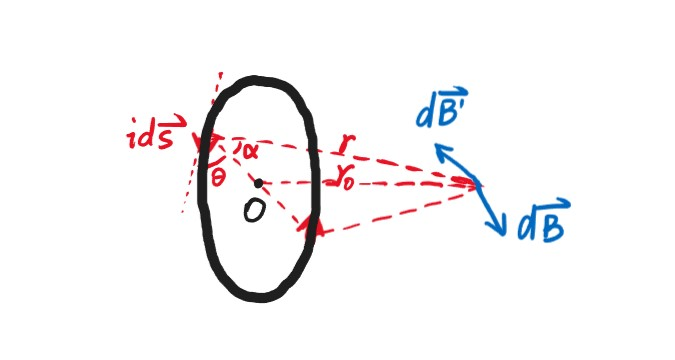  
    方向：由对称性，与轴垂直方向的分量抵消为0，因此沿轴方向  
    大小：  
    对于如图所示的电流元$id\vec{s}$，其产生的磁感应强度大小  
    $dB=\frac{\mu_0}{4\pi}\frac{ids}{r^2}$（两个矢量垂直）  
    沿轴方向的大小  
    $dB_x=dB\cos\alpha=\frac{\mu_0}{4\pi}\frac{ids\cos\alpha}{r^2}=\frac{\mu_0}{4\pi}\frac{ids\cos\alpha\sin^2\alpha}{r_0^2}$  
    $B=\int dB_x=\frac{\mu_0}{4\pi}\frac{i\cos\alpha\sin^2\alpha}{r_0^2}\oint ds=\frac{\mu_0 i}{4\pi r_0^2}\sin^2\alpha\cos\alpha\cdot2\pi R$  
    由于$\sin\alpha=\frac{r_0}{\sqrt{r_0^2+R^2}}$，$\cos\alpha=\frac{R}{\sqrt{r_0^2+R^2}}$  
    因此：  
    $B=\frac{\mu_0}{2}\frac{iR^2}{(r_0^2+R^2)^{\frac{3}{2}}}$  
    当$r_0=0$时，得到的是通电线圈中心的磁感应强度：  
    $B=\frac{\mu_0 i}{2R}$  
    当$r_0\gg R$时：  
    $B=\frac{\mu_0iR^2}{2r_0^3}$  
    与$r^3$成反比  

!!! Example
    **例3：通电铜板正上方的磁感应强度**  

    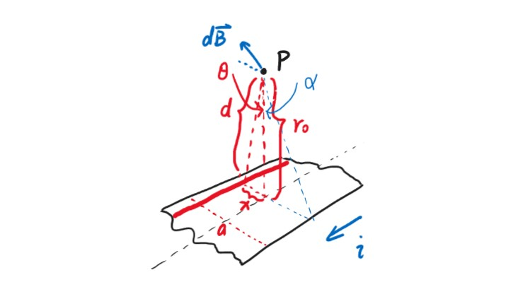  
    方向：如图  
    大小：将铜板沿电流方向无限分割成条，每条宽度为$dx$，通过的电流为$di$  
    考虑距离中心线为$x$的铜条，其产生的磁感应强度与例1中无限长导线的一致：  
    $dB=\frac{\mu_0di}{2\pi d}=\frac{\mu_0\frac{i}{a}dx}{2\pi d}$  
    其在$x$方向上的分量为：  
    $dB_x=dB\cos\theta$  
    由于$d=\frac{r_0}{\cos\theta}$  
    因此代入积分得：  
    $B_x=\int dB_x=\frac{\mu_0 i}{2\pi ar_0}\int\cos^2\theta dx$  
    由于$\frac{x}{r_0}=\tan\theta$  
    $dx=\frac{r_0d\theta}{\cos^2\theta}$  
    因此：  
    $B_x=\frac{\mu_0i}{2\pi a}\int_{-\alpha}^{\alpha}d\theta=\frac{\mu_0 i}{\pi a}\alpha=\frac{\mu_0 i}{\pi a}\tan^{-1}\frac{a}{2r_0}$  
    当点离铜板很远，即$r_0\rightarrow\infty$时：  
    $\alpha\approx\tan\alpha=\frac{a}{2r_0}$  
    $B=\frac{\mu_0 i}{2\pi r_0}$  
    此时类似于例1，可将无限长的铜板看作一根线  
    当点在铜板上，即$r_0=0,\alpha=\frac{\pi}{2}$时：  
    $B=\frac{\mu_0i}{2a}$  

!!! Example
    **例4：通电螺线管内中心轴上的磁感应强度**

    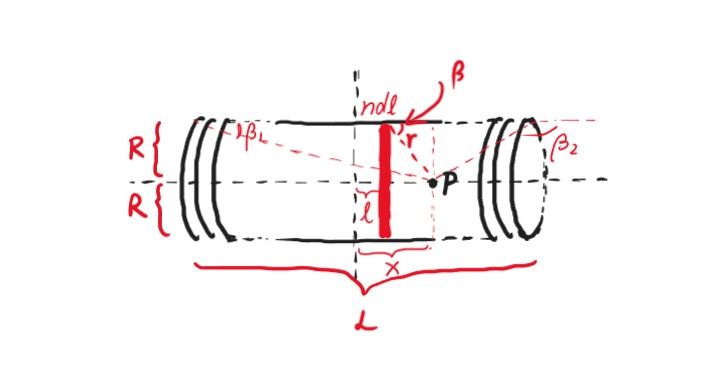   
    我们可以将螺线管看作许多线圈，其中单位长度螺线管包含的线圈数量为$n$  
    现在要求的是距离螺线管最中间距离为$x$的点$P$的磁感应强度  
    考虑距离螺线管最中间距离为$l$的一小组线圈，共有$ndl$个  
    根据例2，这些线圈在$P$处产生的磁感应强度大小  
    $dB=ndl\frac{\mu_0}{2}\frac{iR^2}{[(x-l)^2+R^2]^{\frac{3}{2}}}$  
    从最左边积分到最右边：  
    $B=\int dB=\frac{\mu_0niR^2}{2}\int_{-\frac{L}{2}}^{\frac{L}{2}}\frac{dl}{[(x-l)^2+R^2]^{\frac{3}{2}}}$  
    进行换元：  
    $r=\sqrt{(x-l)^2+R^2}=\frac{R}{\sin\beta}$  
    $\frac{R}{x-l}=\tan\beta\Rightarrow dl=\frac{R}{\sin^2\beta}d\beta$  
    因此：  
    $B=\frac{\mu_0ni}{2}\int_{\beta_1}^{\beta_2}\sin\beta d\beta=\frac{\mu_0ni}{2}(\cos\beta_1-\cos\beta_2)$  
    其中：  
    $\cos\beta_1=\frac{x+\frac{L}{2}}{\sqrt{R^2+(x+\frac{L}{2})^2}}$，$\cos\beta_2=\frac{x-\frac{L}{2}}{\sqrt{R^2+(x-\frac{L}{2})^2}}$  
    当螺线管无限长，即$L\rightarrow\infty$，$\beta_1=0$，$\beta_2=\pi$时：  
    $B=\mu_0ni$  
    当$P$位于螺线管最右端，即$\beta_1=0$，$\beta_2=\frac{\pi}{2}$时：  
    $B=\frac{\mu_0ni}{2}$  

!!! Example
    **例5：多层螺线管内中心轴上的磁感应强度**

    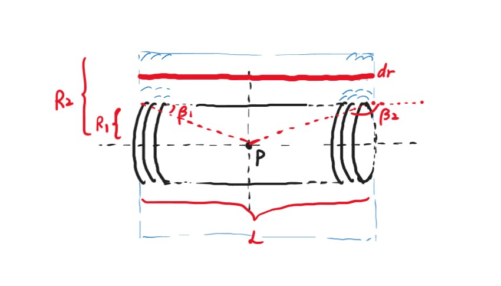  
    利用例4的公式：  
    $B=\frac{\mu_0ni}{2}(\cos\beta_1-\cos\beta_2)$  
    （注意：此时使用角度，而不是具体展开）  
    $ni$为单位长度的总电流  
    设线圈总数为$N$  
    则其穿过的总横截面积为$L(R_2-R_1)$  
    电流密度$j=\frac{Ni}{L(R_2-R_1)}$  
    取一层$dr$，则这一层的总电流  
    为$jLdr=\frac{Nidr}{R_2-R_1}$  
    这一层单位长度的总电流为$\frac{Nidr}{L(R_2-R_1)}$，用于替换原式的$ni$  
    因此  
    $dB=\frac{\mu_0}{2}\frac{Nidr}{L(R_2-R_1)}(\cos\beta_1-\cos\beta_2)$  
    以最简单的为例：求螺线管正中心的磁感应强度，则  
    $\cos\beta_1=-\cos\beta_2$  
    $\cos\beta_1=\frac{\frac{L}{2}}{\sqrt{r^2+(\frac{L}{2})^2}}$  
    代入$dB$并积分：  
    $B=\frac{\mu_0Ni}{2(R_2-R_1)}\int_{R_1}^{R_2}\frac{dr}{\sqrt{r^2+(\frac{L}{2})^2}}=\frac{\mu_0Ni}{2(R_2-R_1)}\ln\frac{R_2+\sqrt{R_2^2+(\frac{L}{2})^2}}{R_1+\sqrt{R_1^2+(\frac{L}{2})^2}}$  

***

## 7.3 磁场的高斯定理与环路定理

**磁通量：**

$$\Phi_B=\iint\vec{B}\cdot d\vec{A}$$

$$B=\lim\limits_{\Delta A\rightarrow 0}\frac{\Delta\Phi_B}{\Delta A}$$

**磁场的高斯定理：**

$$\iint\limits_{\substack{\circ}}\vec{B}\cdot d\vec{A}=0$$

**磁场的安培环路定理：**

$$\oint \vec{B}\cdot d\vec{l}=\mu_0\sum\limits_{in~loop}i$$

电流$i$的正负判断：若环路为逆时针，则向外为正，向内为负；若环路为顺时针，则向内为正，向外为负

!!! Note
    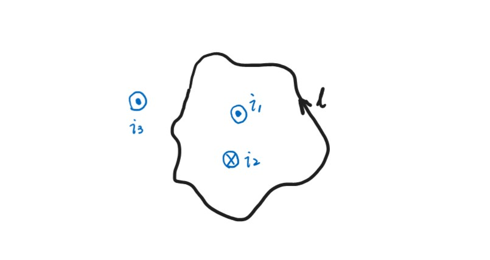  
    $\oint \vec{B}\cdot d\vec{l}=\mu_0(+i_1-i_2)$  
    实际上电流$i_3$也会在环路上产生磁场，只是不对积分的结果产生影响  

!!! Example
    **例1：无穷长周围的磁感应强度**  

    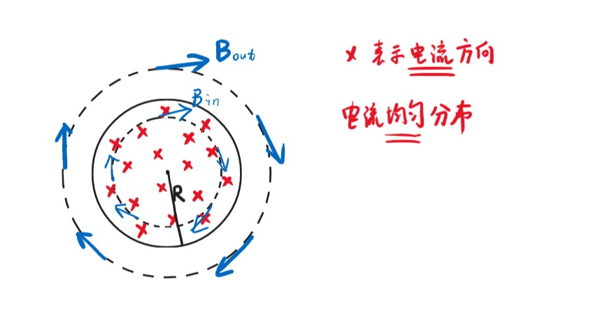  
    外部：  
    $\oint\vec{B}\cdot d\vec{l}=B\cdot 2\pi r=\mu_0 i$  
    $B=\frac{\mu_0 i}{2\pi r}$  
    内部：  
    $\oint\vec{B}\cdot d\vec{l}=B\cdot 2\pi r=\mu_0\frac{r^2}{R^2}i$  
    $B=\frac{\mu_0ir}{2\pi R^2}$

!!! Example
    **例2：无穷大通电板一侧的磁感应强度**  

    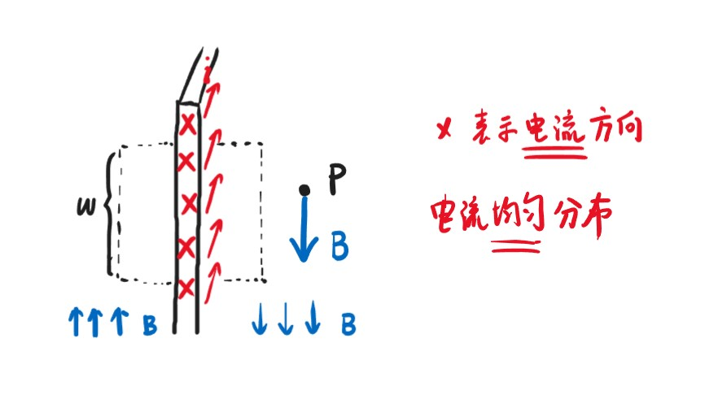  
    设单位宽度电流密度为$n$（有多少根），每根电流大小为$i$  
    如图所示取一正方形环路，边长为$\omega$，其中上下两条边与$B$垂直，点积为0，左右两条边与$B$平行  
    $\oint\vec{B}\cdot d\vec{l}=B\omega+0+B\omega+0=2B\omega=\mu_0n\omega i$  
    $B=\frac{\mu_0 ni}{2}$  

!!! Example
    **例3：无穷长螺线管内部的磁感应强度**  

      
    环路的纵向与$B$垂直，点积为0  
    上边的$B$解释起来比较复杂，但可以想象无穷长的时候$B=0$  
    设单位宽度电流密度为$n$（有多少根），每根电流大小为$i$  
    $\oint\vec{B}\cdot d\vec{l}=B\omega=\mu_0 n\omega i$  
    $B=\mu_0 ni$  

!!! Example
    **例4：螺绕环内部的磁感应强度**  

    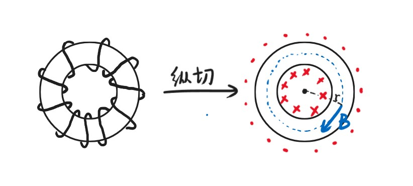  
    由安培环路定理易知：螺绕环外部的$B=0$  
    考虑内部：$N$表示总圈数  
    $\oint\vec{B}\cdot d\vec{l}=B\cdot 2\pi r=\mu_0 Ni$  
    $B=\frac{\mu_0 Ni}{2\pi r}$  

**磁偶极矩：**

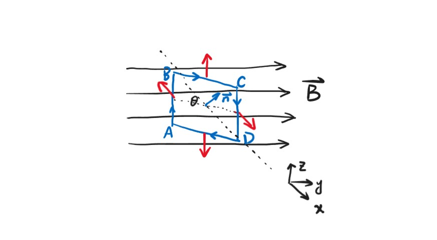

矩形线框竖边长度为$a$，横边长度为$b$，面积为$A=ab$，单位法向量为$\vec{n}$

$$\tau=F_{AB}\cdot\frac{b}{2}\cdot\sin\theta+F_{CD}\cdot\frac{b}{2}\cdot\sin\theta=iaB\cdot\frac{b}{2}\cdot\sin\theta+iaB\cdot\frac{b}{2}\cdot\sin\theta=iBA\sin\theta$$

$$\vec{\tau}=iA(\vec{n}\times\vec{B})=\vec{\mu}\times\vec{B}$$

$$\mu=iA\vec{n}$$

称为**磁偶极矩**。

对于任意形状的线圈，我们可以将其划分为无穷多个矩形线圈，最后得到的结论一样，即：

$$\vec{\tau}=\vec{\mu}\times\vec{B}$$

定义线圈与磁感应强度垂直时势能为0。

设夹角为$\theta$时的势能为$U$

$$\Delta U=U-0=-W=-\int\vec{\tau}\cdot d\vec{\theta}$$

若以上图的矩形线圈为例，则$\vec{\tau}$方向向下，$d\vec{\theta}$（增大的）方向向上，其他情况同理，二者方向相反，因此

$$U=\int\mu B\sin\theta d\theta=-\mu B\cos\theta=-\vec{\mu}\cdot\vec{B}$$

!!! Note
    类比：电场中的电偶极矩的势能：  
    $U=-\vec{p}\cdot\vec{E}$  

对于单一线圈：

$$\mu=i\pi R^2=iA$$

对于$N$绕线圈：

$$\mu=Ni\pi R^2=NiA$$

***

## 7.4 电荷在磁场中的运动

**洛伦兹力：**

$$\vec{F}=q\vec{v}\times\vec{B}$$

$$F=qvB\sin\theta$$

由于力方向一直与速度方向垂直，因此洛伦兹力只改变电荷的速度方向，不改变速度大小。

**洛伦兹力与安培力的联系：**

洛伦兹力（微观）和安培力（宏观）实际上是一回事：

每个电子受到的洛伦兹力：

$$F_L=evB$$

在$\Delta t$时间内：

$$\Delta q=v\Delta t\cdot A\cdot n\cdot e$$

其中，$n$表示电子体密度，即单位体积中的电子数目

$$i=\frac{\Delta q}{\Delta t}=nAve$$

合力：

$$F=nA\Delta s\cdot F_L=nA\Delta s\cdot evB=Bi\Delta s=F_A$$

**回旋加速器（cyclotron）：**

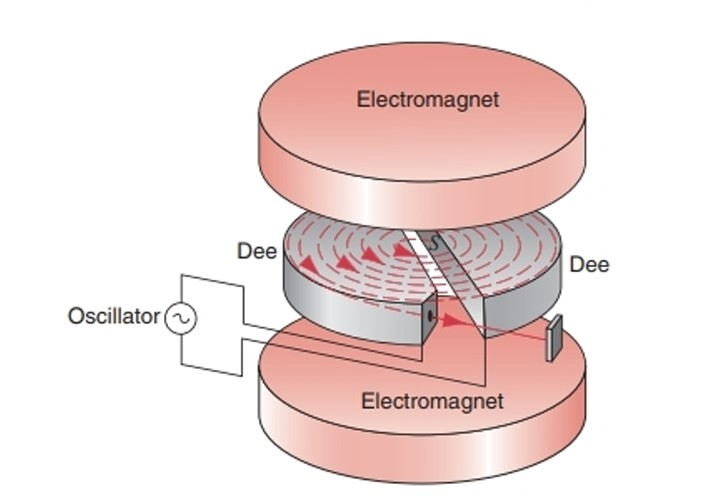

$$qvB=m\frac{v^2}{r}$$

$$T=\frac{2\pi r}{v}=\frac{2\pi m}{qB}$$

$$v_{max}=\frac{BqR}{m}$$

$$E_{kmax}=\frac{1}{2}mv_{max}^2=\frac{B^2R^2q^2}{2m}$$

!!! Note
    如果考虑相对论效应：  
    $m=\frac{m_0}{\sqrt{1-\frac{v^2}{c^2}}}$  
    $T=\frac{2\pi m}{qB}=\frac{2\pi m_0}{qB\sqrt{1-\frac{v^2}{c^2}}}$  
    一般通过调节$B$，使得$B\sqrt{1-\frac{v^2}{c^2}}$为常量  

**霍尔效应（Hall effect）：**

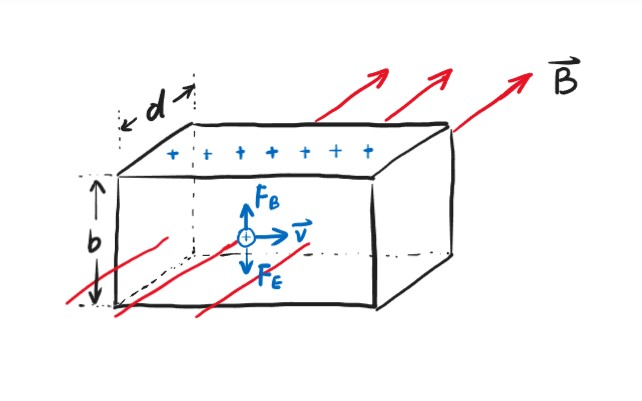

当达到平衡态时：

$$qvB=qE~\Rightarrow ~E=vB$$

$$V=Eb=vBb=\frac{dxBb}{dt}=\frac{dVB}{ddt}=\frac{dqB}{nqddt}=\frac{iB}{nqd}$$

$n$表示单位体积的电荷数。

霍尔电阻：

$$R_H=\frac{V}{i}=\frac{B}{nqd}$$

然而对于二维霍尔元件，霍尔电阻与磁场并不完全成线性关系：

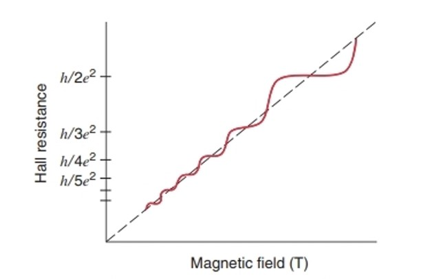

可以$\frac{h}{e^2}$作为其新的霍尔电阻标准。