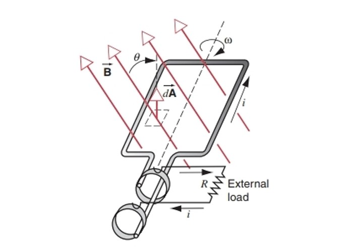

# Chapter8 法拉第电磁感应定律

***

## 8.1 法拉第电磁感应定律与楞次定律

**法拉第电磁感应定律：**

$$\varepsilon=-\frac{d\varPhi_B}{dt}$$

!!! Note
    负号的含义：阻碍磁通量的变化

**楞次定律 Lenz's Law：**

感应电流的产生的磁场总要阻碍引起感应电流的磁通量的变化。

本质是能量守恒：在克服阻碍的过程中，其他形式能转化为电能。

***

## 8.2 动生电动势

$$\varepsilon=\int(\vec{v}\times\vec{B})\cdot d\vec{l}$$

!!! Tip "Proof"
    洛伦兹力$F_L=e(\vec{v}\times\vec{B})$  
    若建立电场且达到平衡：  
    $eE=e(\vec{v}\times\vec{B})$  
    $E=\vec{v}\times\vec{B}$  
    $\varepsilon=\int(\vec{v}\times\vec{B})\cdot d\vec{l}$  

!!! Note
    高中时的默认情况：$\varepsilon=BVl$

!!! Example
    **求金属棒两端电势$\varepsilon$。**  

    

    **法一：积分**

    $d\varepsilon=(\vec{v}\times\vec{B})\cdot d\vec{r}=-Bvdr$  
    $\varepsilon=-\int_0^RBvdr=-\int_0^RB\omega rdr=-\frac{1}{2}B\omega R^2$  

    **法二：法拉第电磁感应定律**  

    考虑扇形区域$oab$  
    $\varPhi_B=BA=B(\frac{1}{2}R^2\theta)$  
    $\varepsilon=-\frac{d\varPhi_B}{dt}=-\frac{1}{2}BR^2\frac{d\theta}{dt}=-\frac{1}{2}B\omega R^2$  

**发电机和电动机（Generators and Motors）:**

$$\varPhi_B=\vec{B}\cdot\vec{A}=BA\cos\theta=BA\cos\omega t$$

$$\varepsilon=-\frac{d\varPhi_B}{dt}=BA\omega\sin\omega t$$

***

## 8.3 感生电动势

由法拉第电磁感应定律：

$$\varepsilon=-\frac{d\varPhi_B}{dt}=-A\frac{dB}{dt}$$

由做功的定义：

$$W=\varepsilon q_0,~Fs=q_0E_{induced}\cdot 2\pi R,~W=Fs$$

$$\varepsilon=\oint\vec{E}_{induced}\cdot d\vec{l}$$

因此：

$$\oint\vec{E}_{induced}\cdot d\vec{l}=-\frac{d\varPhi_B}{dt}$$

从更广的角度来看电场的环路定律：

$$\vec{E}=\vec{E_{sta}}+\vec{E_{ind}}$$

$$\oint\vec{E}\cdot d\vec{l}=\oint(\vec{E_{sta}}+\vec{E_{ind}})\cdot d\vec{l}=0+(-\frac{d\varPhi_B}{dt})=-\frac{d\varPhi_B}{dt}$$

!!! Note
    感应电场的产生不依赖于真实回路或电线的存在，会依赖真实回路或电线的只有感应电流。

如左图所示，如果大圆范围内的$B$均匀增加，则与大圆同圆心的圆上的$E_{induced}$方向沿圆的切线方向，不与大圆同圆心的圆则不然。

如右图所示，方形磁场是不存在的，因为其顶角的$E$方向无法判断。