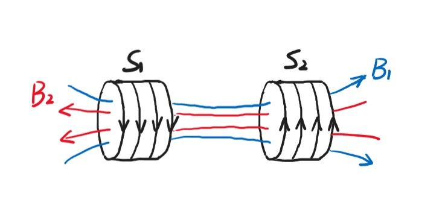
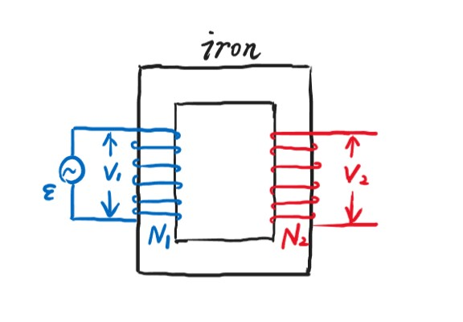
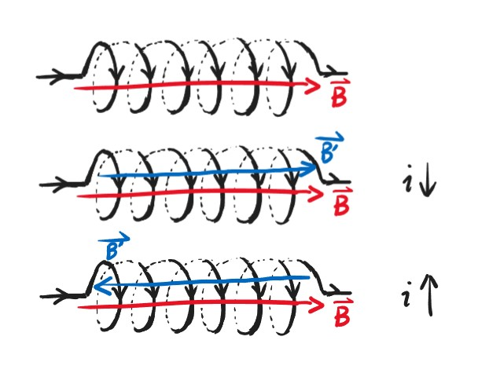
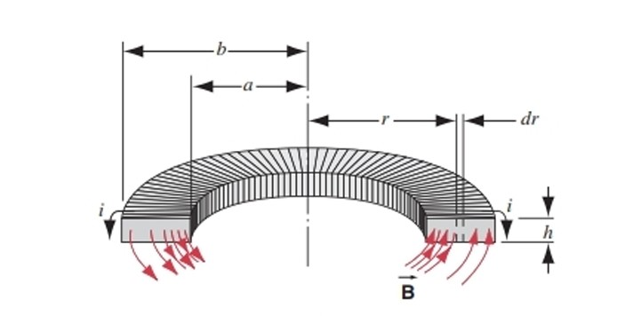
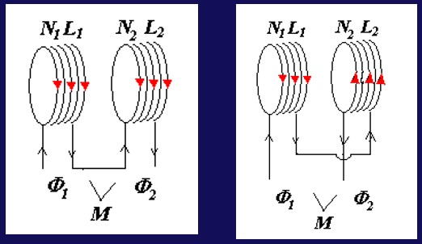

# Chapter9 电感与材料的磁性质

***

## 9.1 互感

由于$S_1$对$S_2$的磁通链
$$\Psi_{12}\propto N_2A_2B_1$$

又由于

$$B_1\propto i_1$$

因此可定义

$$\Psi_{12}=M_{12}i_1$$

同理：

$$\Psi_{21}=M_{21}i_2$$

互感电动势：

$$\varepsilon_2=-\frac{d\Psi_{12}}{dt}=-M_{12}\frac{di_1}{dt}$$

$$\varepsilon_1=-\frac{d\Psi_{21}}{dt}=-M_{21}\frac{di_2}{dt}$$

$M_{12}$，$M_{21}$被称为**互感系数**，通常情况下

$$M_{12}=M_{21}=M$$

单位为亨利（H）。

**变压器：**

$$\frac{V_1}{V_2}=\frac{N_1}{N_2}$$

***

## 9.2 自感

$$\Psi=NBA=Li$$

$$\varepsilon_L=-\frac{d\Psi}{dt}=-L\frac{di}{dt}$$

!!! Note
    对于电阻为0的“超导”，其两端接上电压后电流并不为无穷大，因为有自感现象。

$L$称为**自感系数**，单匝时定义为

$$L=\frac{\varPhi_B}{i}$$

多匝时定义为

$$L=\frac{\Psi}{i}$$

!!! Example
    **例1：求长方形螺绕环的自感系数。**

      
    $\oint\vec{B}\cdot d\vec{l}=\mu_0 Ni$  
    $B=\frac{\mu_0 Ni}{2\pi r}$  
    $\varPhi_B=\iint\vec{B}\cdot d\vec{A}=\int_a^b\frac{\mu_0 Ni}{2\pi r}hdr=\frac{\mu_0 Nih}{2\pi}\int_a^b\frac{dr}{r}=\frac{\mu_0 Nih}{2\pi}\ln\frac{b}{a}$  
    $L=\frac{N\varPhi_B}{i}=\frac{\mu_0 N^2h}{2\pi}\ln\frac{b}{a}$  

!!! Example
    **例2：同轴电缆**  

    由安培环路定理：$\oint\vec{B}\cdot d\vec{l}=\mu_0 i$  
    $B=\frac{\mu_0 i}{2\pi r}$  
    $\varPhi_B=\iint\vec{B}\cdot d\vec{A}=\int_{R_1}^{R_2}Bldr=\frac{\mu_0il}{2\pi}\ln(\frac{R_2}{R_1})$  
    $L=\frac{\varPhi_B}{i}=\frac{\mu_0l}{2\pi}\ln(\frac{R_2}{R_1})$  

**自感和互感的关系：**

假设第一个螺线管的自感系数为$L_1$，第二个螺线管的自感系数为$L_2$，则二者的互感系数：

$$M=\sqrt{L_1L_2}$$

若两个螺线管顺接（电流大小相等，方向相同）：

$$L=L_1+L_2+2M=L_1+L_2+2\sqrt{L_1L_2}$$

若两个螺线管反接（电流大小相等，方向相反）：

$$L=L_1+L_2-2M=L_1+L_2-2\sqrt{L_1L_2}$$

***

## 9.3 材料的磁性质 

**磁导率：**

螺线管插上铁棒，自感系数增加$\kappa_m$倍：

$$L=\kappa_mL_0$$

$\kappa_m$被称为**磁导率**。

**原子的磁性：**

若有单一的价电子，其绕着原子核转，形成磁偶极矩：

$$\mu=iA$$

$$i=\frac{e}{T}=\frac{ev}{2\pi r}$$

$$\mu=\frac{ev}{2\pi r}\cdot \pi r^2=\frac{1}{2}erv$$

对于角动量：

$$\vec{l}=\vec{r}\times\vec{p}$$

其中$\vec{p}$为动量

对于这个电子：

$$l=rmv$$

因此

$$\vec{\mu_l}=-\frac{e}{2m}\vec{l}$$

**磁化强度：**

每个原子都有一个杂乱无章的$\mu$，若在磁场中，会有力矩

$$\vec{\tau}=\mu\times\vec{B}$$

外磁场$\vec{B}_0$使得$\mu$转到它的方向,等效成产生一圈大电流（束缚电流$i'$），对应$\vec{B_M}$，方向一致

$$\vec{B}=\vec{B_0}+\vec{B_M}$$

$$\vec{M}=\frac{\sum\vec{\mu}_M}{\Delta V}$$

$$\oint\vec{M}\cdot d\vec{l}=\sum i'$$

$$\oint\vec{B}\cdot d\vec{l}=\mu_0\sum\limits_{In}(i_0+i')=\mu_0\sum\limits_{In}i_0+\mu_0\oint\vec{M}\cdot d\vec{l}$$

$$\oint(\frac{\vec{B}}{\mu_0}-\vec{M})\cdot d\vec{l}=\sum\limits_{In}i_0$$

**磁场强度**：

$$\vec{H}=\frac{\vec{B}}{\mu_0}-\vec{M}$$

**广义安培环路定理：**

$$\oint\vec{H}\cdot d\vec{l}=\sum\limits_{In}i_0$$